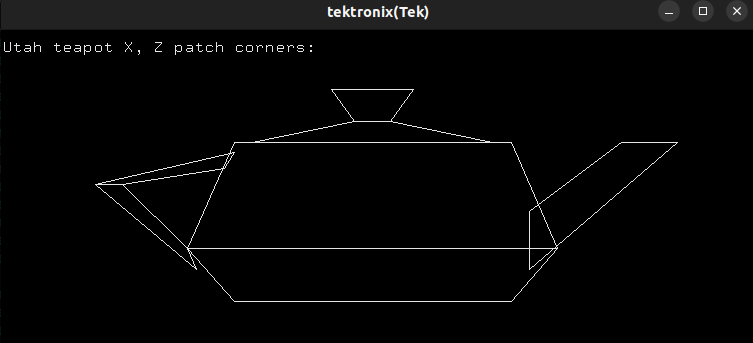
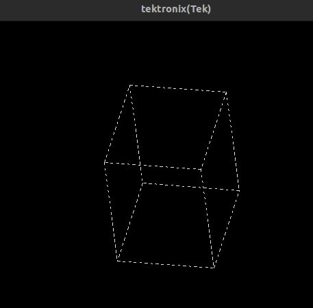

# CT-BASIC

CTBASIC is a compiled [Sinclair BASIC](https://en.wikipedia.org/wiki/Sinclair_BASIC) inspired language targeting a "fantasy console" architecture using the [cyclic tag system](https://esolangs.org/wiki/Cyclic_tag_system) computational model.

It compiles a reduced dialect of BASIC into one of the following compilation targets:

* [CT](https://esolangs.org/wiki/Bitwise_Cyclic_Tag#The_language_CT) (Cyclic Tag) — a three symbol language `{0, 1, ;}`, or set of bitstring productions.
* [BCT](https://esolangs.org/wiki/Bitwise_Cyclic_Tag) (Bitwise Cyclic Tag) — a two symbol language `{0, 1}` encoding the above.
* [ABCT](https://github.com/hornc/abctag) (Arithmetic Bitwise Cyclic Tag) — BCT encoded into a single integer.
* [Rule 110](https://en.wikipedia.org/wiki/Rule_110) elementary cellular automaton, using the ["blocks of bits" construction developed and described by Matthew Cook](https://doi.org/10.4204/eptcs.1.4).

This is an experimental project / work in progress. Details and usability are being worked out as features are added.

The idea is to capture something of the early days of practical programming (i.e. the BASIC era) while using low level cyclic tag systems for 'useful' programs.

### The Fantasy Console

CTBASIC compiles to standard versions of the above cyclic-tag families, so any compiled program _will_ run on all of them.
However, in order to provide some user feedback, the CTBASIC architecture assumes a particular set of output conventions, which distinguish a CTBASIC 'machine' from a plain cyclic-tag interpreter.

These differences _only_ apply to I/O, where the output conventions are side-effects (not affecting the underlying computation, and the input conventions only affect starting (and re-starting) states, so also don't affect the fundamental computational process.

The CTBASIC machine I/O conventions are as follows:

1) Byte strings can be encoded and recognised within the data-string:
   * 8 bit bytes are encoded within a 10 bit data-frame with start-bit `1` and end-bit `0`.
   * A string is a series of 10-bit frames beginning with the [ASCII C0](https://en.wikipedia.org/wiki/C0_and_C1_control_codes) `STX` character (0x02), and terminated by the `ETX` character (0x03).
   * When a valid string is completed, (i.e. the stop-bit `0` of the `ETX` is appended to the right of the data-string) the complete string is sent to output.

2) Output is a serial byte-stream, with flexible destinations.
   * The CTBASIC language has drawing commands which when compiled produce serial byte output that can be recognised by [Tektronix 4010/4](https://en.wikipedia.org/wiki/Tektronix_4010) compatible terminals.
   * Non-graphical serial terminals are also intended to be supported for character output.
   * Other byte-based output targets are also a possibility (e.g. audio, serial input to other devices).

3) Interactive mode:
   * An optional execution mode whereby when the data-string becomes empty (the standard **halt** condition) the user is prompted for more input to replenish the data-string. Previous program output could perhaps give the user some guidance on how to binary-encode an appropriate input response.
   * If a new data-string input is provided, the program resumes with the next cyclic production.
   * If no new input is provided, the program halts.

### General cyclic-tag input considerations

A standard feature of Cyclic Tag family of languages is that they require a non-empty, non-zero, data string to begin (and continue) execution.

If the initial data string is empty, or does not contain _any_ `1` symbols, a program _cannot possibly_ modify the data string, so no computation will occur.

This means that for any CT family program to perform a computation, an appropriate input data string _MUST_ be provided.
At minimum, this input data string can be a single `1`. From this, a program can bootstrap any required data structure to allow it to accomplish its computation.

Specific user supplied variable input will need to be encoded in some fashion into the initial data string, the instructions for which will depend on the specific program being run.
In general, there will need to be at least one `1` symbol for the program to have a chance of recognising the full range of user supplied inputs, including 'blank' input.
Providing an input data-string beginning with a `0` symbol will in general prevent a program from functioning correctly (unless the expected behaviour is "do nothing").

### The CTBASIC language

CTBASIC effectively provides ZX Spectrum BASIC style output macros to simplify forming output using the provided conventions.
* `PRINT`, `CHR$`, `CLS`, `PLOT`, `DRAW`, and `INK` for output.
* `BIN`, `DATA`, `FILL`, `ZFILL`, `ASM` for internal data.

All control flow is provided by the underlying cyclic tag mechanism.

Every command (output or memory writing) is conditional on there being a `1` at the leftmost bit of the current data-string.

All `CLEAR` commands (removing 1 or more bits from the data-string) are _unconditional_.

The entire program runs in an implicit loop until the data-string is empty.

The `END` command does not immediately end the program, but is a alias for `CLEAR 10`, which clears the data-string frame by frame, which if _all_ data is correctly aligned on `0` stop-bits, can allow the program to cycle as many times as needed to clear the entire data-string without triggering any further output or effects. This however requires careful planning, and is not guaranteed to occur cleanly otherwise.
It is a fragile convention.

### Commands

See the [Command list](COMMANDS.md) for implemented and aspirational commands and syntax.

See [`examples/`](examples/) for how the commands can be used together.

### Cyclic Tag Interpreter

CTBASIC comes with a simple [Cyclic Tag interpreter](ct.py) to test CTBASIC programs behave as intended when compiled to the default Cyclic Tag dialect. It supports the input and output conventions, and will execute CTBASIC examples as intended (assuming correct mode flags and terminals are used).

### Example usage

* Compile [Hello, World! example](examples/HELLOWORLD.BAS) to cyclic tag:

    ./CTBASIC.py examples/HELLOWORLD.BAS

  * **output:* `1000000100101001000010110010101011011000101101100010110111101001011000100100000010101011101011011110101110010010110110001011001000100100001010000101001000000110;;;;;;;;;;`

* Use the included cyclic tag interpreter [ct.py](ct.py) to run the above and display output (input data = `1`):

    ./ct.py <(./CTBASIC.py examples/HELLOWORLD.BAS) 1

  * **output:** `Hello, World!`

* Compile to arithmetic cyclic tag:

    ./CTBASIC.py -tABCT examples/HELLOWORLD.BAS

  * **output:** `2188296472577726911166636231243756842502740360147865646454687653848030097758545005123757741056578902`

* Compile to rule 110 'blocks':

    ./CTBASIC.py -t110 examples/HELLOWORLD.BAS

* Compile and run a [simple loop demonstration](examples/LOOP10.BAS):

    ./ct.py <(./CTBASIC.py examples/LOOP10.BAS)

* Compile and run a standard terminal [character 'animation' example](examples/ANIM_FRAME_TEST.BAS):

    ./ct.py --hold 300 <(./CTBASIC.py examples/ANIM_FRAME_TEST.BAS)

* Compile and run a (unary) [input example](examples/1_TO_10_OUTPUT.BAS):

    ./ct.py <(./CTBASIC.py examples/1_TO_10_OUTPUT.BAS) 11111111

  * Vary the number of `1`s as input between `1` and `1111111111` (10).

* Using [xterm](https://invisible-island.net/xterm/), compile and run a static graphics example: [2D Utah teapot](examples/teapot.bas):

    xterm -hold -t -e "./ct.py <(./CTBASIC.py examples/teapot.bas  ) 1"

* Use `xterm` to display an [animated rotating cube](examples/CUBE.BAS):

    xterm -hold -t -e "./ct.py --hold 100  <(./CTBASIC.py examples/CUBE.BAS)"

* Use interactive mode to play a simple (cheating) [coin flip game](examples/coin_flip.bas):

    ./ct.py --interactive <(./CTBASIC.py examples/coin_flip.bas) 1
